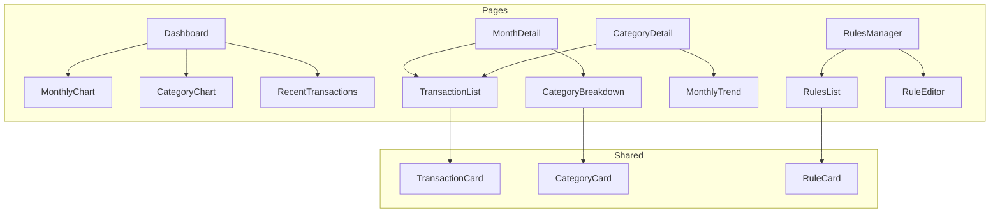
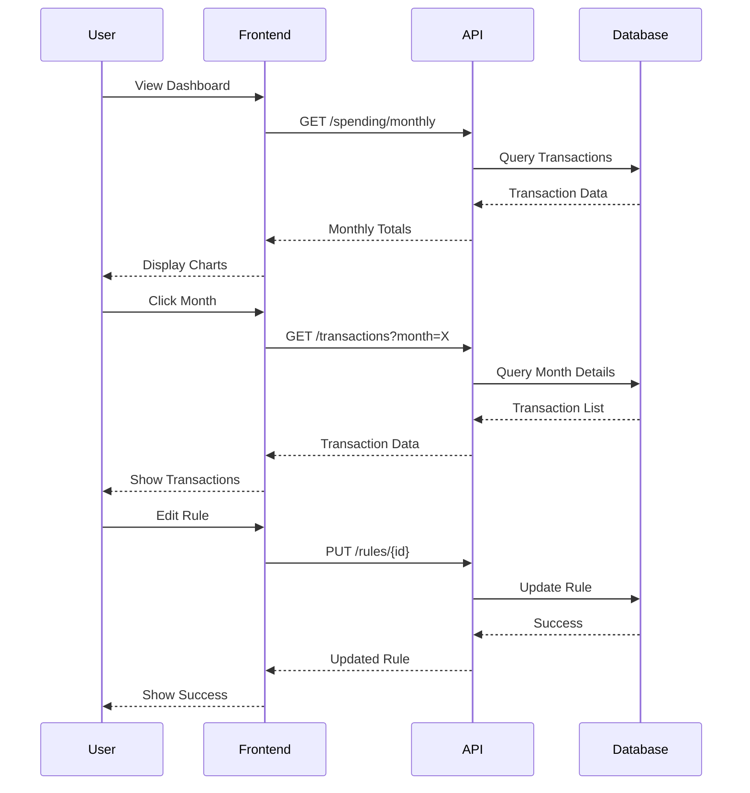

# Budget Builder GUI Architecture

## Overview

The GUI will be implemented as a web application with a REST API backend to leverage the existing Python codebase while providing a modern, interactive user interface.

```mermaid
graph TB
    subgraph Frontend
        UI[Web UI - React]
        subgraph Components
            Dashboard[Dashboard View]
            MonthView[Monthly Analysis]
            CatView[Category Analysis]
            TransView[Transaction List]
            RuleEditor[Rules Editor]
        end
        subgraph State
            Store[Redux Store]
        end
    end

    subgraph Backend
        API[FastAPI Server]
        subgraph Endpoints
            E1[/spending/monthly]
            E2[/spending/categories]
            E3[/transactions]
            E4[/rules]
        end
        subgraph Existing
            Analytics
            Categorization
            Database
        end
    end

    UI --> API
    API --> Existing
```

## Component Structure



## Data Flow



## Technical Stack

### Frontend
- **Framework**: React with TypeScript
- **State Management**: Redux Toolkit
- **UI Components**: Material-UI
- **Charts**: Recharts or Chart.js
- **API Client**: Axios

### Backend
- **Framework**: FastAPI
- **Database Access**: SQLAlchemy (existing)
- **API Documentation**: OpenAPI/Swagger
- **Authentication**: JWT

## Key Features

1. **Dashboard**
   - Monthly spending trend chart
   - Category distribution pie chart
   - Recent transactions list
   - Quick filters and date range selection

2. **Monthly Analysis**
   - Detailed breakdown of monthly spending
   - Category comparison with previous month
   - Transaction list with search and filters
   - Export functionality

3. **Category Analysis**
   - Category spending over time
   - Sub-category breakdown
   - Related rules overview
   - Transaction patterns

4. **Transaction Management**
   - Sortable/filterable transaction list
   - Transaction details view
   - Category assignment
   - Rule creation from transaction

5. **Rules Management**
   - Rule list with search
   - Rule editor with validation
   - Rule testing interface
   - Bulk rule operations

## Implementation Phases

1. **Phase 1: API Development**
   - Set up FastAPI server
   - Implement core endpoints
   - Add OpenAPI documentation
   - Write API tests

2. **Phase 2: Frontend Foundation**
   - Create React project structure
   - Implement routing
   - Set up state management
   - Create base components

3. **Phase 3: Core Features**
   - Dashboard implementation
   - Transaction list view
   - Basic charts and visualizations
   - Rule management interface

4. **Phase 4: Advanced Features**
   - Interactive drilling down
   - Advanced filtering
   - Export functionality
   - Bulk operations

5. **Phase 5: Polish**
   - Performance optimization
   - Error handling
   - Loading states
   - Responsive design
