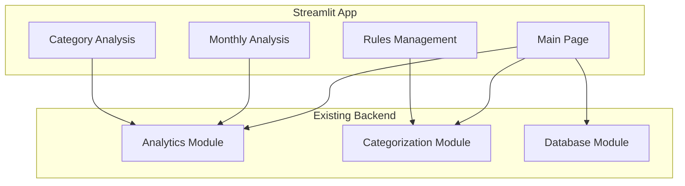
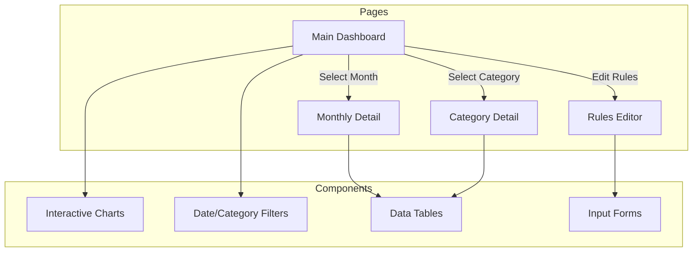
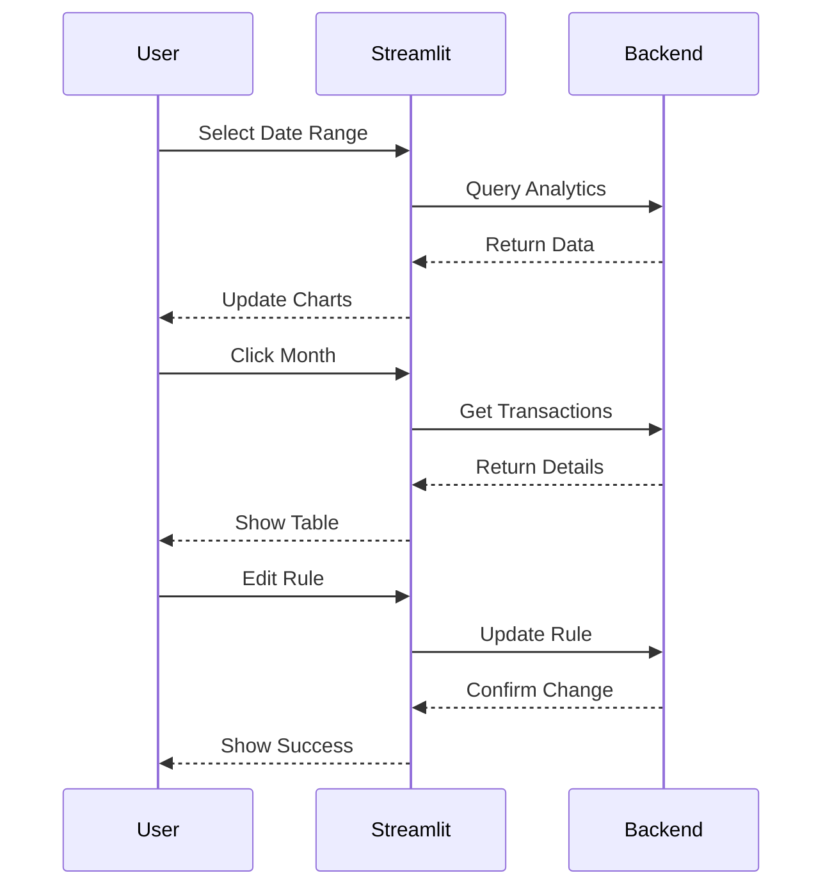

# Budget Builder Streamlit GUI Architecture

## Overview

The GUI will be implemented using Streamlit to rapidly prototype the visualization and interaction features while directly leveraging the existing Python codebase.

## Page Structure

## Key Features

1. **Main Dashboard**
   - Monthly spending trend chart (st.line_chart)
   - Category distribution (st.pie_chart)
   - Date range selector (st.date_input)
   - Category filter (st.multiselect)

2. **Monthly Analysis**
   - Transaction table with sorting/filtering (st.dataframe)
   - Category breakdown
   - Click-through to transaction details
   - Export to CSV button (st.download_button)

3. **Category Analysis**
   - Monthly trend for category
   - Transaction list filtered by category
   - Associated rules overview
   - Sub-category breakdown if applicable

4. **Rules Management**
   - Rules table with editing (st.data_editor)
   - Rule testing interface
   - Validation feedback
   - Apply/Reset buttons

## Implementation Approach

1. **Phase 1: Core Dashboard**
   - Set up Streamlit app structure
   - Implement basic charts
   - Add date/category filters
   - Display transaction tables

2. **Phase 2: Interactivity**
   - Add drill-down capabilities
   - Enable sorting/filtering
   - Implement click-through navigation
   - Add export functionality

3. **Phase 3: Rules Interface**
   - Create rules editor
   - Add validation
   - Enable testing
   - Implement feedback

## Technical Components

### Streamlit Features to Use
- **Charts**: st.line_chart, st.bar_chart, st.pie_chart
- **Data Display**: st.dataframe, st.table
- **Inputs**: st.date_input, st.multiselect, st.text_input
- **Layout**: st.sidebar, st.columns, st.expander
- **Interactivity**: st.button, st.download_button
- **Data Editing**: st.data_editor
- **State Management**: st.session_state

### Integration Points
- Direct access to existing Python modules
- No API layer needed
- In-memory data processing
- SQLAlchemy for database operations

## Advantages of This Approach

1. **Rapid Development**
   - Built-in components
   - No frontend/backend split
   - Direct Python integration
   - Minimal boilerplate

2. **Easy Prototyping**
   - Instant visual feedback
   - Simple state management
   - Built-in interactivity
   - Quick iterations

3. **Backend Integration**
   - Direct access to existing code
   - No API needed
   - Simple data flow
   - Native Python types

4. **User Experience**
   - Interactive visualizations
   - Responsive interface
   - Easy navigation
   - Data exploration

## Data Flow Examples

This architecture leverages Streamlit's strengths for rapid prototyping while maintaining all required functionality. It allows for quick development and iteration while providing a solid foundation that can be expanded or refactored later if needed.
